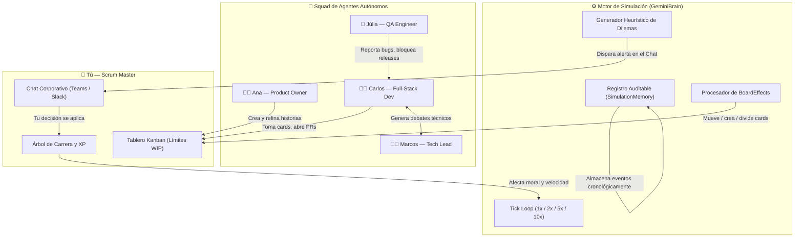

<div align="center">


<br/>

[](./README.md)
[](./README-PT.md)
[](./README-ES.md)

<br/>

[](https://elpadrinhobr.github.io/tass-kanban/)
[](https://github.com/ElPadrinhoBR/tass-kanban/stargazers)
[](./LICENSE)

<br/>

[](https://react.dev)
[](https://www.typescriptlang.org)
[](https://vitejs.dev)
[](https://tailwindcss.com)
[](./src/i18n)

</div>

---

## ⚡ Descripción General

**TASS Kanban** es un **simulador de vuelo interactivo para equipos ágiles, Scrum Masters y Tech Leaders** — impulsado por cuatro agentes autónomos de IA que piensan, debaten, se bloquean mutuamente y toman decisiones reales de ingeniería de software en tiempo real.

> *Deja de leer teoría. Empieza a tomar decisiones.*

En lugar de un tutorial pasivo, TASS te pone al mando de un Sprint completo. Tu squad tiene mente propia — abren PRs, debaten opciones de arquitectura, reportan bugs críticos y crean dilemas éticos que solo tú puedes resolver. Cada decisión que tomas otorga XP y da forma a tu **carrera como Scrum Master**.

**🎮 [Acceder al Demo en Vivo — Sin Instalación](https://elpadrinhobr.github.io/tass-kanban/)**

---

## 🤖 Los Cuatro Agentes Autónomos

Cada agente ejecuta un **motor de comportamiento independiente** con personalidad, memoria y heurísticas profesionales. Interactúan entre sí y reaccionan a tus decisiones:

| Agente | Rol | Comportamientos y Disparadores |
|:---:|:---|:---|
| 👩‍💼 **Ana Oliveira** | Product Owner | Prioriza el backlog, negocia el alcance, cuestiona las estimaciones de velocidad |
| 👨‍💻 **Carlos Silva** | Full-Stack Dev | Abre PRs, introduce deuda técnica, provoca debates de arquitectura |
| 👨‍🏫 **Marcos Souza** | Tech Lead | Impone calidad de código, bloquea merges, propone Spikes técnicos |
| 🧪 **Júlia Lima** | QA Engineer | Reporta bugs críticos, cuestiona criterios de aceptación, bloquea releases |

---

## 🏗️ Arquitectura y Motor de Simulación



---

## ✨ Funcionalidades

| Categoría | Capacidad |
|:---|:---|
| 🎮 **Gameplay** | Simulación de Sprint con velocidad configurable (1x, 2x, 5x, 10x) |
| 🤖 **IA Autónoma** | 4 agentes con personalidades independientes y lógica de comportamiento |
| 💬 **Chat Corporativo** | Interfaz estilo Slack / Teams con 4 canales dedicados |
| ⚡ **Motor de Dilemas** | Desafíos de decisión del Scrum Master en tiempo real con recompensa XP |
| 🏆 **Progresión de Carrera** | Escalera gamificada de 10 niveles del Aprendiz al Agile Coach |
| 🎨 **Temas Visuales** | 5 temas corporativos profesionales (Trello Blue, Jira, Linear, Nordic, Midnight Pro) |
| 🌐 **Multilingüe** | Soporte completo para Portugués 🇧🇷, Inglés 🇺🇸 y Español 🇪🇸 |
| 📋 **Tablero Kanban** | Drag-and-drop con límites WIP, story points y categorías |
| 📊 **Métricas Ágiles** | Monitoreo en tiempo real de velocidad, moral y riesgo del sprint |
| 🔍 **Glosario Ágil** | Más de 60 términos con tooltips interactivos sensibles al contexto |
| 📝 **Registro de Auditoría** | Historial de decisiones descargable para uso en retrospectivas |
| 🌙 **Modo Daily Scrum** | Simulación de reloj en tiempo real con evento Daily a las 18h |

---

## 🎮 Dinámica de Juego

| Situación | Qué Ocurre |
|:---|:---|
| Carlos abre un PR con deuda técnica | Marcos bloquea el merge; decides aceptarlo o exigir una refactorización |
| El backlog se desborda (límite WIP violado) | Ana exige recortes de prioridad; tu elección impacta la velocidad |
| Júlia reporta un bug de severidad 1 | Sprint en riesgo; eliges entre un hotfix inmediato o posponer |
| La moral del equipo cae por debajo del 60% | Pausa de café o retrospectiva: tu liderazgo restaura el espíritu del equipo |
| Conflicto de arquitectura (Redis vs. Postgres) | Standstill de 3h; medias con un Spike Timebox o un comando directo |

Cada decisión se categoriza como:
- 🟦 **Liderazgo de Servicio** — colaborativo, alta recompensa XP
- 🟨 **Trade-off Pragmático** — equilibrado, XP medio
- 🟥 **Anti-Patrón** — autoritario o evasivo, penalización XP

---

## 🚀 Guía de Instalación

### Requisitos
- Node.js ≥ 18
- npm ≥ 9

### Ejecutar Localmente
```bash
# 1. Clonar
git clone https://github.com/ElPadrinhoBR/tass-kanban.git
cd tass-kanban

# 2. Instalar dependencias
npm install

# 3. Iniciar servidor de desarrollo
npm run dev
```

La app se abrirá en **http://localhost:5173**

### Build de Producción
```bash
npm run build
npm run preview
```

### Desplegar en GitHub Pages
```bash
npm run deploy
```

---

## 🤝 Cómo Contribuir

¡Las contribuciones son bienvenidas! Lee [CONTRIBUTING.md](./CONTRIBUTING.md) antes de empezar.

```bash
# Fork → clonar → crear rama de funcionalidad
git checkout -b feat/mi-funcionalidad
# Commit siguiendo Conventional Commits
git commit -m "feat: agregar mi funcionalidad"
# Abrir Pull Request
```

---

## 📄 Licencia

Este proyecto está licenciado bajo la **Licencia MIT** — ver [LICENSE](./LICENSE) para más detalles.

---

## 👤 Autor

Desarrollado con pasión por **Roberto (El Padrinho)** — Estudiante de Gestión de Tecnologías de la Información (TI), entusiasta de metodologías ágiles (Scrum / Kanban) y futuro líder técnico.

- GitHub: [@ElPadrinhoBR](https://github.com/ElPadrinhoBR)
- Proyecto: [TASS Kanban](https://github.com/ElPadrinhoBR/tass-kanban)

---

<div align="center">

**Hecho con ❤️ para la comunidad Ágil global**

⭐ ¡Si TASS te ayudó a formar mejores Scrum Masters, por favor dale una estrella!

[](https://github.com/ElPadrinhoBR/tass-kanban/stargazers)

</div>
