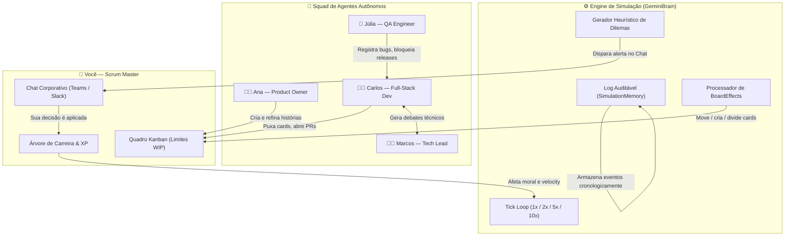

<div align="center">


<br/>

[](./README.md)
[](./README-PT.md)
[](./README-ES.md)

<br/>

[](https://elpadrinhobr.github.io/tass-kanban/)
[](https://github.com/ElPadrinhoBR/tass-kanban/stargazers)
[](./LICENSE)

<br/>

[](https://react.dev)
[](https://www.typescriptlang.org)
[](https://vitejs.dev)
[](https://tailwindcss.com)
[](./src/i18n)

</div>

---

## ⚡ Visão Geral

**TASS Kanban** é um **simulador de voo interativo para equipes ágeis, Scrum Masters e Tech Leaders** — alimentado por quatro agentes autônomos de IA que pensam, discutem, travam uns aos outros e tomam decisões reais de engenharia de software em tempo real.

> *Chega de ler teoria. Comece a tomar decisões.*

Em vez de um tutorial passivo, o TASS coloca você no comando de uma Sprint completa. Seu squad tem vontade própria — eles abrem PRs, debatem escolhas de arquitetura, registram bugs críticos e criam dilemas éticos que só você pode resolver. Cada decisão que você toma concede XP e molda sua **carreira de Scrum Master**.

**🎮 [Acessar Demo Online — Sem Instalação](https://elpadrinhobr.github.io/tass-kanban/)**

---

## 🤖 Os Quatro Agentes Autônomos

Cada agente roda uma **engine comportamental independente** com personalidade, memória e heurísticas profissionais. Eles interagem entre si e reagem às suas decisões:

| Agente | Função | Comportamentos & Gatilhos |
|:---:|:---|:---|
| 👩‍💼 **Ana Oliveira** | Product Owner | Prioriza backlog, negocia escopo, questiona estimativas de velocity |
| 👨‍💻 **Carlos Silva** | Full-Stack Dev | Abre PRs, introduz dívida técnica, provoca debates de arquitetura |
| 👨‍🏫 **Marcos Souza** | Tech Lead | Impõe qualidade de código, bloqueia merges, propõe Spikes técnicos |
| 🧪 **Júlia Lima** | QA Engineer | Registra bugs críticos, questiona critérios de aceite, bloqueia releases |

---

## 🏗️ Arquitetura e Engine de Simulação



---

## ✨ Funcionalidades

| Categoria | Capacidade |
|:---|:---|
| 🎮 **Gameplay** | Simulação de Sprint com velocidade configurável (1x, 2x, 5x, 10x) |
| 🤖 **IA Autônoma** | 4 agentes com personalidades independentes e lógica comportamental |
| 💬 **Chat Corporativo** | Interface estilo Slack / Teams com 4 canais dedicados |
| ⚡ **Engine de Dilemas** | Desafios de decisão do Scrum Master em tempo real com recompensa em XP |
| 🏆 **Progressão de Carreira** | Escada gamificada de 10 níveis do Aprendiz ao Agile Coach |
| 🎨 **Temas Visuais** | 5 temas corporativos profissionais (Trello Blue, Jira, Linear, Nordic, Midnight Pro) |
| 🌐 **Multilíngue** | Suporte completo a Português 🇧🇷, Inglês 🇺🇸 e Espanhol 🇪🇸 |
| 📋 **Quadro Kanban** | Drag-and-drop com limites WIP, story points e categorias |
| 📊 **Métricas Ágeis** | Monitoramento em tempo real de velocity, moral e risco da sprint |
| 🔍 **Vocabulário Ágil** | Mais de 60 termos com tooltips interativos sensíveis ao contexto |
| 📝 **Log de Auditoria** | Histórico de decisões para download e uso em retrospectivas |
| 🌙 **Modo Daily Scrum** | Simulação de relógio em tempo real com eventos Daily às 18h |

---

## 🎮 Dinâmica de Jogo

| Situação | O que Acontece |
|:---|:---|
| Carlos abre um PR com dívida técnica | Marcos bloqueia o merge; você decide aceitar ou exigir refatoração |
| Backlog transborda (limite WIP violado) | Ana exige cortes de prioridade; sua escolha impacta a velocity |
| Júlia registra um bug de severidade 1 | Sprint em risco; você escolhe entre hotfix imediato ou adiamento |
| Moral do time cai abaixo de 60% | Pausa do café ou retrospectiva: sua liderança restaura o espírito do time |
| Conflito de arquitetura (Redis vs. Postgres) | Standstill de 3h; você media com Spike Timebox ou um comando direto |

Cada decisão é categorizada como:
- 🟦 **Liderança Servidora** — colaborativa, alta recompensa XP
- 🟨 **Trade-off Pragmático** — equilibrada, XP médio
- 🟥 **Anti-Padrão** — autoritária ou evasiva, penalidade XP

---

## 🚀 Guia de Instalação

### Requisitos
- Node.js ≥ 18
- npm ≥ 9

### Rodar Localmente
```bash
# 1. Clonar
git clone https://github.com/ElPadrinhoBR/tass-kanban.git
cd tass-kanban

# 2. Instalar dependências
npm install

# 3. Iniciar servidor de desenvolvimento
npm run dev
```

O app abrirá em **http://localhost:5173**

### Build de Produção
```bash
npm run build
npm run preview
```

### Deploy no GitHub Pages
```bash
npm run deploy
```

---

## 🤝 Como Contribuir

Contribuições são bem-vindas! Leia o [CONTRIBUTING.md](./CONTRIBUTING.md) antes de começar.

```bash
# Fork → clone → criar branch de feature
git checkout -b feat/minha-feature
# Commit seguindo Conventional Commits
git commit -m "feat: adicionar minha feature"
# Abrir Pull Request
```

---

## 📁 Estrutura do Projeto

```
tass-kanban/
├── src/
│   ├── components/          # Componentes de UI (Kanban, Chat, Modais)
│   ├── data/                # Dados iniciais do cenário, temas, presets do chat
│   ├── gamification/        # Sistema de XP, níveis de carreira, conquistas
│   ├── i18n/                # Dicionários multilíngues (PT / EN / ES)
│   ├── simulation/          # Engine GeminiBrain, SimulationMemory, relógio
│   ├── types/               # Interfaces TypeScript (Kanban, Chat, Agentes)
│   └── utils/               # Parser do glossário, utilitários
├── public/                  # Assets estáticos (banner, ícones)
├── ARCHITECTURE.md          # Documentação técnica de arquitetura
├── CONTRIBUTING.md          # Guia de contribuição
└── LICENSE                  # Licença MIT
```

---

## 📄 Licença

Este projeto está licenciado sob a **Licença MIT** — veja [LICENSE](./LICENSE) para detalhes.

---

<div align="center">

**Feito com ❤️❤️ para a comunidade Ágil brasileira e global**

⭐ Se o TASS ajudou você a treinar melhores Scrum Masters, por favor dê uma estrela!

[](https://github.com/ElPadrinhoBR/tass-kanban/stargazers)

</div>
