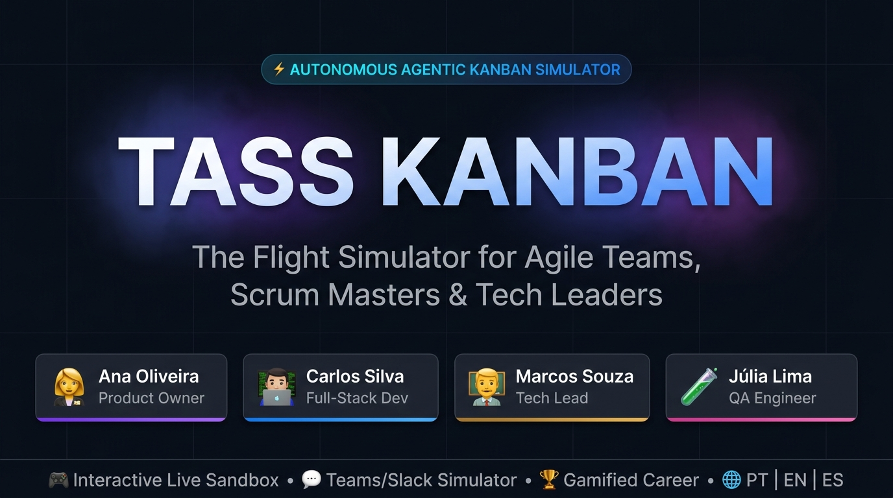
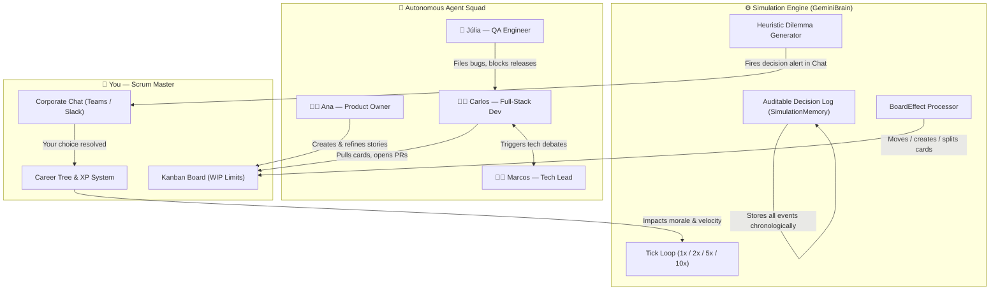

<div align="center">



<br/>

[](./README.md)
[](./README-PT.md)
[](./README-ES.md)

<br/>

[](https://elpadrinhobr.github.io/tass-kanban/)
[](https://github.com/ElPadrinhoBR/tass-kanban/stargazers)
[](./LICENSE)

<br/>

[](https://react.dev)
[](https://www.typescriptlang.org)
[](https://vitejs.dev)
[](https://tailwindcss.com)
[](./src/i18n)

</div>

---

## ⚡ Overview

**TASS Kanban** is an **interactive flight simulator for Agile teams, Scrum Masters, and Tech Leaders** — powered by four autonomous AI agents that think, argue, block each other, and make real software engineering trade-offs in real time.

> *Stop reading theory. Start making decisions.*

Instead of a passive tutorial, TASS puts you in command of a complete Sprint. Your squad has a mind of their own — they open PRs, debate architectural choices, file critical bugs, and create ethical dilemmas only you can resolve. Every decision you make awards XP and shapes your **Scrum Master career path**.

**🎮 [Launch the Live Demo — No Installation Required](https://elpadrinhobr.github.io/tass-kanban/)**

---

## 🤖 The Four Autonomous Agents

Each agent runs an **independent behavioral engine** with personality, memory, and professional heuristics. They interact with each other and react to your decisions:

| Agent | Role | Behaviors & Triggers |
|:---:|:---|:---|
| 👩‍💼 **Ana Oliveira** | Product Owner | Prioritizes backlog, negotiates scope, challenges velocity estimates |
| 👨‍💻 **Carlos Silva** | Full-Stack Dev | Opens PRs, introduces tech debt, triggers architecture debates |
| 👨‍🏫 **Marcos Souza** | Tech Lead | Enforces code quality, blocks merges, proposes technical spikes |
| 🧪 **Júlia Lima** | QA Engineer | Files critical bugs, challenges acceptance criteria, blocks releases |

---

## 🏗️ Architecture & Simulation Engine



---

## ✨ Features

| Category | Capability |
|:---|:---|
| 🎮 **Gameplay** | Sprint simulation with configurable speed (1x, 2x, 5x, 10x) |
| 🤖 **Autonomous AI** | 4 agents with independent personalities and behavioral logic |
| 💬 **Corporate Chat** | Slack / Teams-style interface with 4 dedicated channels |
| ⚡ **Dilemma Engine** | Real-time Scrum Master decision challenges with XP rewards |
| 🏆 **Career Progression** | 10-level gamified career ladder from Apprentice to Agile Coach |
| 🎨 **Visual Themes** | 5 professional UI themes (Trello Blue, Jira, Linear, Nordic, Midnight Pro) |
| 🌐 **Multilingual** | Full support for Portuguese 🇧🇷, English 🇺🇸, and Spanish 🇪🇸 |
| 📋 **Kanban Board** | Drag-and-drop with WIP limits, story points, and categories |
| 📊 **Agile Metrics** | Real-time velocity, morale, and sprint risk monitoring |
| 🔍 **Agile Glossary** | 60+ terms with context-sensitive interactive tooltips |
| 📝 **Audit Log** | Downloadable decision history for retrospectives |
| 🌙 **Daily Scrum Mode** | Real-time clock simulation with 18h Daily Scrum events |

---

## 🎮 Game Dynamics

| Situation | What Happens |
|:---|:---|
| Carlos opens a PR with tech debt | Marcos blocks the merge; you decide whether to accept it or demand a refactor |
| Backlog overflows (WIP limit breach) | Ana demands priority cuts; your choice impacts velocity |
| Júlia files a severity-1 bug | Sprint is at risk; you choose between hotfix now or defer to next sprint |
| Team morale drops below 60% | Coffee break or retrospective: your leadership decision restores team health |
| Architecture conflict (Redis vs. Postgres) | 3-hour standstill; you mediate with a Spike Timebox or a command |

Each decision is categorized as:
- 🟦 **Servant Leadership** — collaborative, high XP reward
- 🟨 **Pragmatic Trade-off** — balanced, medium XP
- 🟥 **Anti-Pattern** — authoritarian or avoidant, penalty XP

---

## 🚀 Quickstart

### Requirements
- Node.js ≥ 18
- npm ≥ 9

### Run Locally
```bash
# 1. Clone
git clone https://github.com/ElPadrinhoBR/tass-kanban.git
cd tass-kanban

# 2. Install dependencies
npm install

# 3. Start development server
npm run dev
```

App will open at **http://localhost:5173**

### Build for Production
```bash
npm run build
npm run preview
```

### Deploy to GitHub Pages
```bash
npm run deploy
```

---

## 🛣️ Roadmap

- [ ] 🤖 Dynamic AI responses via Gemini API (bring your own API key)
- [ ] 📱 Mobile-responsive layout
- [ ] 🌍 More languages (French, German, Japanese)
- [ ] 🔌 Real Jira / Trello board import
- [ ] 👥 Multiplayer (team vs. team sprint simulation)
- [ ] 📊 Sprint retrospective report export (PDF)

---

## 🤝 Contributing

Contributions are welcome! Please read [CONTRIBUTING.md](./CONTRIBUTING.md) first.

```bash
# Fork → clone → create a feature branch
git checkout -b feat/my-feature
# Commit following Conventional Commits
git commit -m "feat: add my feature"
# Open a Pull Request
```

See [Good First Issues →](https://github.com/ElPadrinhoBR/tass-kanban/issues?q=is%3Aissue+is%3Aopen+label%3A%22good+first+issue%22)

---

## 📁 Project Structure

```
tass-kanban/
├── src/
│   ├── components/          # UI components (Kanban, Chat, Modals)
│   ├── data/                # Initial scenario data, themes, chat presets
│   ├── gamification/        # XP system, career levels, achievements
│   ├── i18n/                # Multilingual dictionaries (PT / EN / ES)
│   ├── simulation/          # GeminiBrain engine, SimulationMemory, clock
│   ├── types/               # TypeScript interfaces (Kanban, Chat, Agents)
│   └── utils/               # Glossary parser, helpers
├── public/                  # Static assets (banner, icons)
├── ARCHITECTURE.md          # Technical deep-dive
├── CONTRIBUTING.md          # Contribution guide
└── LICENSE                  # MIT License
```

---

## 📄 License

This project is licensed under the **MIT License** — see [LICENSE](./LICENSE) for details.

---

## 👤 Author

Developed with passion by **Roberto (El Padrinho)** — IT Management Student (*Estudante de Gestão de TI*), Agile enthusiast, and aspiring Tech Leader.

- GitHub: [@ElPadrinhoBR](https://github.com/ElPadrinhoBR)
- Project: [TASS Kanban](https://github.com/ElPadrinhoBR/tass-kanban)

---

<div align="center">

**Made with ❤️ for the Agile community**

⭐ If TASS helps you train better Scrum Masters, please star this repository!

[](https://github.com/ElPadrinhoBR/tass-kanban/stargazers)

</div>
